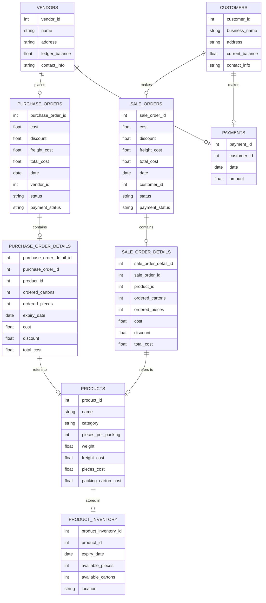
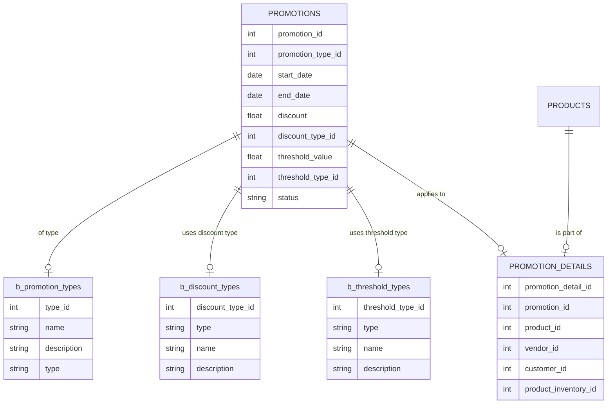

# Overview
An inventory management system that can be used to optimize inventory tracking, streamline procurement processes, and enhance overall warehouse management. The system is designed for small businesses to replace the current manual inventory tracking process and enable real-time inventory updates, accurate reporting.

# Objectives
The main objectives of this project are to:

- Automate inventory tracking to improve accuracy and reduce human error.
- Provide real-time visibility into stock levels, orders, and deliveries.
- Implement a user-friendly interface for warehouse staff, procurement, and sales teams.
- Ensure the system is scal-able to accommodate future growth and new inventory features.
- Provide detailed reporting and analytics to optimize inventory levels, reduce stock outs, and prevent overstocking.
- Enable barcode scanning and RFID integration for faster and more efficient inventory management (Optional) .

# System Architecture
## Backend

It will be a mutltitenant Saas application. There will be a main database or systems database where all the API keys stored the main request will be sent  to this server which will then get routed to the clients database depending on the API key.

### Entities (Not final)
Vendors
- Name
- Address
- Ledger Balance
- Contact Info

Customers
- Business Name
- Address
- Current Balance
- Contact Info

Product 
- Name
- Category
- Pieces Per Packing
- Weight
- Freight Cost
- Pieces Cost
- Packing/Carton Cost

Product Inventory
- Expiry Date
- Available Pieces
- Available Cartons
- Location ()

Purchase Order
- Cost
- Discount
- Freight Cost
- Total Cost
- Date
- Vendor Id
- List of PurchaseOrderDetails
- Status
- Payment Status

Purchase Order Details
- Product Id
- Ordered Cartons
- Ordered Pieces
- Expiry Date
- Cost
- Discount
- Total Cost

Sale Order
- Cost
- Discount
- Freight Cost
- Total Cost
- Date
- Customer Id
- List of SaleOrderDetails
- Status
- Payment Status

Sale Order Details
- Product Id
- Ordered Cartons
- Ordered Pieces
- Cost
- Discount
- Total Cost

Payments
- Customer Id
- Date
- Amount

Configs
Over ride the b_config

### Features
- Ability to add, update, delete vendors info.
- Ability to add, update, delete customers info.
- Ability to create vendor/customer orders
- Ability to maintain ledgers
- Order will be prepared and then delivered also marked as completed
- Orders payment status will also be marked with unpaid, paid, ledger
- Ability to dynamically calculate the max and min amount of a product for a given customer
- Ability to create promotions

### Diagrams

#### Initial

### Promotions
Promotions can be made to sell items i.e special discounts either on sale, or by creating a bundle. Promotions can also be created to automatically enable of a threshold limit is hit. Promotions will expire after a specific time.

b_promotion_types
- name
- description
- type
b_threshold_types
- type
- name
- description
b_discount_types
- type
- name
- description

Promotion
- ID
- Type
- start date
- end date
- discount
- discount_type
- threshold value
- threshold type
- status

Promotion_details
 - id
 - promotion_id
 - product_id
 - product_inventory_id
 - vendor_id
 - customer_id
 

#### Configs
We are storing different values in the configs these value will act as configurations for our application for different clients config entity will tell where the config will apply like on product, product_inventory etc. Entity Id will be the value. There will also be a base_table b_configs if there is no value then it will be used as a default value.
configs
- config_type
- config_entity
- entity_id
- config_value
b_configs
- config_type
- config_description
- default_value
#### Amount Calculation
To calculate the total payment amount of a sale order we need to do the following. 
1. Check the value of config sale_rate_algo. It possible values will be average, product_rate, purchase_rate, purchase_rate+margin, product_rate_margin.
2. Check the value of margin from configs.
3. Calculate the rate for each product.
4. Then we can check if the order qualifies for any promotion and give discounts.
No ERD for this case as it's a bit complex

### Returns
This is to return damaged or expired items. Items can be returned from consumers they can return the whole order or a small single item. In this case a new consumer_return_claim will be generated. The customer will get the same item or credits for the returned items the cost of the credit cannot be more then the total price paid for purchase. Once returned we can either return the item to vendor or discard it. Once all items are returned or discarded the return claim will be closed.

Return Claim 
- Customer Id
- Date
- List of Return_claim_details
- Status
- Payment Status
return claim details
- Product Id
- returned Cartons
- returned Pieces
- order_id
- claimed_type
- claimed_cost
- status
